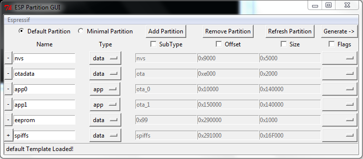

# esp-partition-gui {ESP32 Partition Manager}  
   
The ESP32 Partition Manager is a tool that eases the process of creating CSV files for partitioning ESP range of IoT Boards. this program can be launched by running `python esp-partition.py` from a terminal.
checkout [ESP32Partitions](https://github.com/francis94c/ESP32Partitions) for the latest installation file that enables you launch this tool from the Arduino IDE Tools menu.  

# Important

To enable the application work properly, you must set the directory path to your ESP32 hardware abstraction distribution. Visit [ESP32 Hardware](https://github.com/espressif/arduino-esp32.git) for more info.  
This is to enable the program have access to the ESP32 generator script and other resources offered by the distribution.You only need set this path once.

To set the ESP32 directory path, select the `Espressif` Menu and choose `Preferences`.  
You will be presented the with the window below.

  

You must have python installed and added to PATH.  
python27 (supported)
